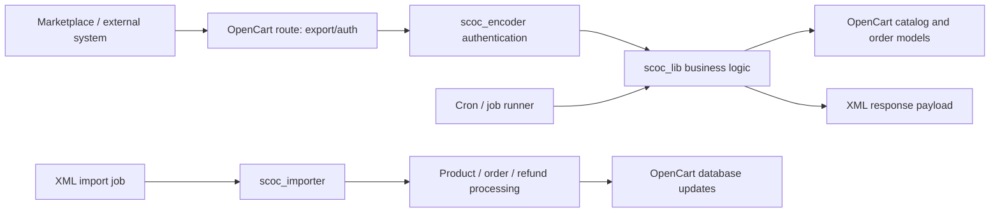

# OpenCart Marketplace Sync Plugin

This repository contains a legacy OpenCart extension that exports catalog, order, shipment and return data to an external marketplace or sync endpoint and accepts XML job payloads for import processing.

## 1. Objective

The code in this repository is not a modern application framework. It is an OpenCart plugin intended to be installed into an existing store and then called by a downstream system over XML endpoints. The main flows are:

- product export for catalog synchronization
- category export for storefront taxonomy sync
- order export for downstream order processing
- inventory and shipping export for fulfilment updates
- XML job import for product, order cancellation, order refund and inventory updates
- scheduled execution through cron and job-based processing

This plugin does not provide a standalone storefront or a new database model. It relies on the OpenCart runtime, its catalog tables, and the admin user session that already exists in the host store.

## 2. Architecture

This project follows a legacy layered pattern rather than a modern clean-architecture layout. The plugin sits inside the OpenCart application structure, with controller classes under `src/catalog/controller/scoc/` and shared logic under `src/system/library/`.

Key components:

- `src/catalog/controller/scoc/export.php` — public XML endpoints for auth, product, order, category, inventory and shipping output
- `src/catalog/controller/scoc/import.php` — receives XML import jobs and starts the importer
- `src/catalog/controller/scoc/job.php` — returns job details and log output
- `src/catalog/controller/scoc/cron.php` — cron entry point
- `src/system/library/scoc_lib.php` — core data access and XML formatting logic
- `src/system/library/scoc_encoder.php` — query-string authentication and decryption
- `src/system/library/scoc_importer.php` — import pipeline for XML payloads
- `src/system/library/scoc_utility.php` — string and XML sanitisation helpers

## 3. Coding style

This repository keeps the original legacy naming and structure for compatibility with installed OpenCart stores.

- Language: PHP
- Platform: OpenCart 2.x / 3.x style controller and library layout
- Conventions: legacy class names such as `scoc_lib`, `scoc_encoder`, and `ControllerScocExport` are retained to avoid breaking the extension contract
- Data access: direct OpenCart registry access and database queries, not a service container
- Error handling: XML responses with status and message fields, plus job state updates in the database
- Testing: pure logic tests for string sanitisation and XML-safe input handling; integration tests are manual on a real store
- Commit convention: small, reviewable changes with one task per commit

## 4. Installation and deployment

1. Copy the contents of `src/` into the root of the OpenCart store, merging the folders into the matching store paths.
2. Ensure the `catalog/` and `system/` folders land in the correct location for the OpenCart instance.
3. Open the store in a browser and hit the install route, for example:
   - `http://your-store.example/index.php?route=scoc/install/index`
4. After the installer runs, use the OpenCart admin panel to enable or validate the module configuration for the specific deployment.
5. If the store requires a cron or scheduled task, configure the job URL and access credentials in the platform settings instead of embedding them in code.

## 5. Configuration

The original plugin expects runtime values at the store level instead of literal credentials stored in the repository. In practice, the values are supplied by the OpenCart admin environment or by the calling system.

| Setting | Purpose | Example placeholder |
|---|---|---|
| admin username | Store login used by remote integration calls | `CHANGE_ME` |
| admin password | Password used for authenticated XML requests | `CHANGE_ME` |
| remote endpoint | URL the external system calls for product or order export | `https://example.com/index.php?route=scoc/export/product` |
| cron URL | Scheduled call for import or job processing | `https://example.com/index.php?route=scoc/cron` |
| sync job ID | Identifier for job-based processing | `1` |
| store base URL | Used in generated XML output | `https://example.com/` |

## 6. Security and compliance notes

This project was built for a legacy OpenCart environment, so the security baseline is intentionally modest and should be reviewed before production use.

- Authentication uses the OpenCart admin user context and query-string checks rather than a modern OAuth or API key flow.
- Real secrets are not committed to this repository; example values are placeholders only.
- The plugin should be deployed behind HTTPS, with access restricted to the known integration endpoints.
- The code is aligned with GDPR principles for minimal collection and careful handling of store data.
- Security controls map to ISO 27001-style review points such as access control, traceability and configuration hygiene.

## 7. Design decisions

- [Legacy OpenCart sync architecture](docs/adr/001-legacy-opencart-sync.md)

## 8. Known limits and next steps

- The plugin still uses legacy XML-over-HTTP patterns and older PHP conventions.
- Authentication and payload security should be tightened before production use in a modern store environment.
- The project has no full Docker or database environment. It is meant to be validated on a real OpenCart install.
- The codebase has a few legacy naming choices that are preserved for compatibility, even where a modern codebase would rename them.

## 9. AI-assisted line, license, author

This repository was prepared for GitHub showcase use and documentation review. The project remains a real, legacy OpenCart extension and does not claim a broader platform, scale or customer base than the code supports.

- Author: Raman Basu
- Email: ramanbasu.business@gmail.com
- License: see the repository license file if present; otherwise the project should be treated as internal code pending explicit licensing.
- AI-assisted line: this documentation and validation structure were prepared to improve clarity, security hygiene and client-facing presentation without altering the installed extension contract.
